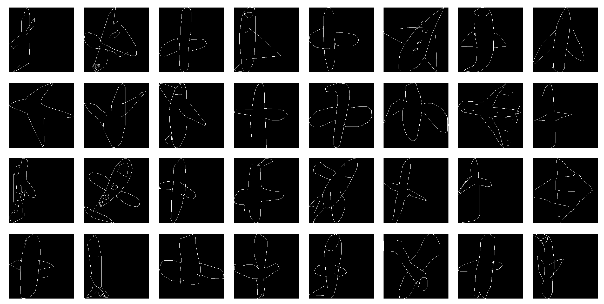

# Conditional random field and residual network for image classification

In this project, I used conditional random field, and later residual network (resnet) to classify images from Google's <a href="https://quickdraw.withgoogle.com/">Quick Draw</a> data. The <a href="https://www.kaggle.com/c/quickdraw-doodle-recognition/data">dataset</a> contains hand drawing data of objects under 340 categories. See images below for drawings under category "plane".

  

I used a conditional randome field to model this problem:

  

Every pixel Xij is connected to 8 neighboring pixels and an edge feature is "turned on" if two pixels connecting the edge were both parts of the drawing. Repeating this for every pixel and we obtain our feature vector \phi(x) for image x. The probability of image x being category y is thus computed as P(y|x) = exp(dot(\phi(x), \theta)) / Z, where \theta is the parameter that we are learning and Z is the partition function. This is easy to implement in pytorch, because we are applying a linear layer on \phi(x), followed by applying a log-softmax layer (because we want to minimize the negative log likelihood).

I first use a small dataset, with only 5 categories, to test if the idea is correct. I used adam as the optimizer.

  

Th elef
