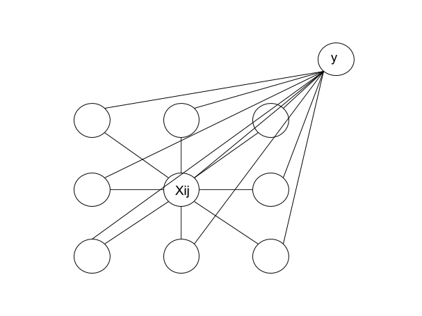

# Conditional random field and residual network for image classification

In this project, I used conditional random field, and later residual network (resnet) to classify images from Google's <a href="https://quickdraw.withgoogle.com/">Quick Draw</a> data. The <a href="https://www.kaggle.com/c/quickdraw-doodle-recognition/data">dataset</a> contains hand drawing data of objects under 340 categories. See images below for drawings under category "plane".

<p align="center">
  
</p>

I used a conditional randome field to model this problem:

<p align="center">
  
</p>

Every pixel Xij is connected to 8 neighboring pixels and an edge feature is "turned on" if two pixels connecting the edge were both parts of the drawing. Repeating this for every pixel and we obtain our feature vector \phi(x) for image x. The probability of image x being category y is thus computed as P(y|x) = exp(dot(\phi(x), \theta)) / Z, where \theta is the parameter that we are learning and Z is the partition function. This is easy to implement in pytorch, because we are applying a linear layer on \phi(x), followed by applying a log-softmax layer (because we want to minimize the negative log likelihood).

I first use a small dataset, with only 5 categories, to test if the idea is correct. I used adam as the optimizer.

<p align="center">
  
</p>

Th above left figures shows that the magnitude of the gradient keeps decreasing. This is expected as our problem is convex. 

<p align="center">
  
</p>

Since the problem is strongly convex with l2-regularization, We reach the optimal solution when the magnitude of the gradient is sufficiently small and does not change. The above results show that the best CRF can do (when we are at the optimial solution) is to have a 70% validation accuracy. I used a large step size when performing the experiment above, so we occationally step over the optimum. Using stochastic gradient descent (SGD) as the optimizer gives similar results. 

The experiment above can be run by the command:

```python adam_training.py --step_size 0.01 --weight_decay 0.00001 --opt_method adam --batch_size 1000 --max_epoch 300```

After trying CRF on the toy dataset (with only 5 categories), I apply CRF to classify 100 categories. 

<p align="center">
  
</p>

The gradient values keep decreasing and validation accuracy keeps increasing. This is good, but our dataset is much bigger now, so each epoch (pass through the dataset) is very expensive. The progress that CRF made between epochs is very small, so I later switched using deep neural networks.

I also tried to use stochastic average gradient (SAG) to optimize the CRF (code in ```sag_training.py```), and the result was not very good.

I later used residual network to solve the classification task. Inputs are drawings with their values normalized.

<p align="center">
  
</p>

Without much hyper-parameter tunning, resnet34 is able to reach 0.7 validation accuracy on all 340 categories. This experiment can be run by the command:

``` python resnet_training.py --batch_size 50 --num_iter_accum_grad 400 --step_size 0.001 --opt_method adam --model_name resnet34 ```

